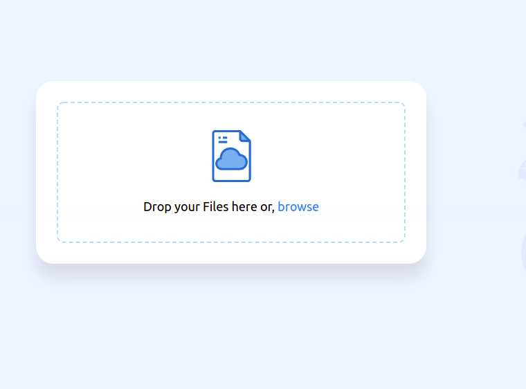
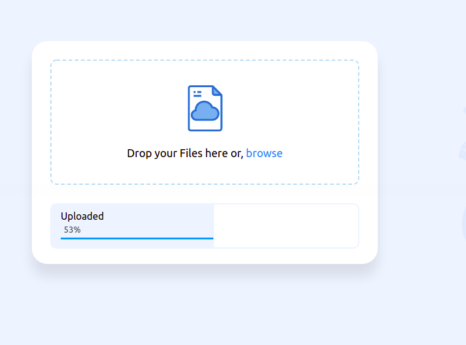
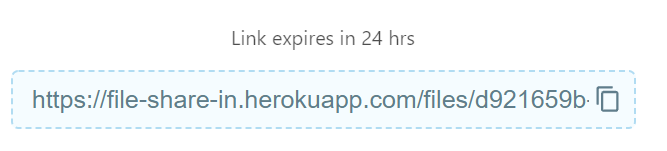
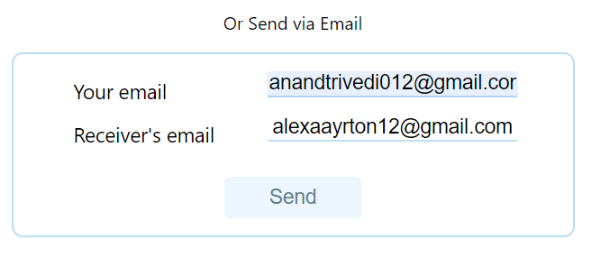
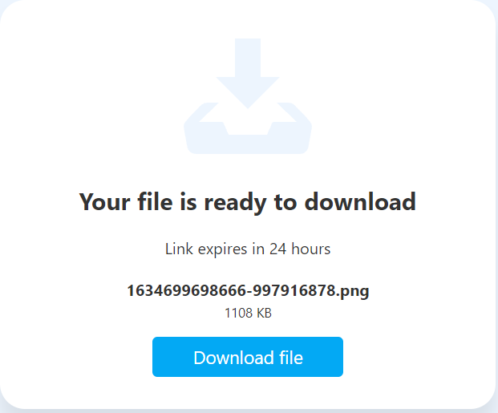
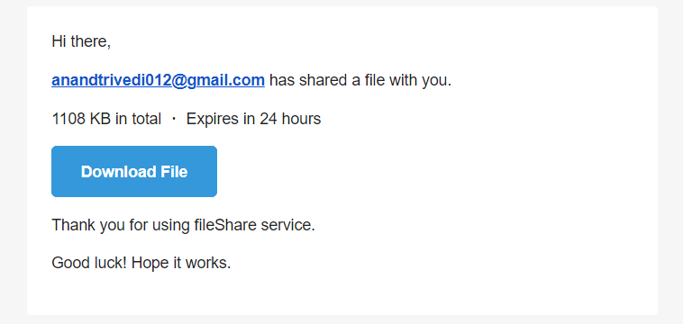

# File Share - easy file sharing

Simple file sharing web app with drag and drop file upload

> ApI is hosted at Heroku and frontend at netlify [Give it a try !!](https://quick-file-share.netlify.app/)

## Overview:)

- **file share is a simple file sharing webapp that share file upto 100MB size.**

## Techstack used:)

- Node.js
- MongoDB (Database)
- Express.js
- HTML
- CSS
- JavaScript
- Netlify (Deployment)
- Netlify Scheduler (For deleting file after 24 hour)

## How to used:)

- Go to this link https://quick-file-share.netlify.app and click on browse or dragg file
  and keep in mind file size should we <= 100MB and don't upload a folder make
  a zip file before uploading.

- Now file upload will start uplading to the server

- After upload is finished you will get an unque link to copy
  share that link to that perosn you want's to share file

- Or you can mail that unique link by providing correct email

- After pasting that unique link will open a download page and you have to simply click on download file

- The email send to the reciver will look like

